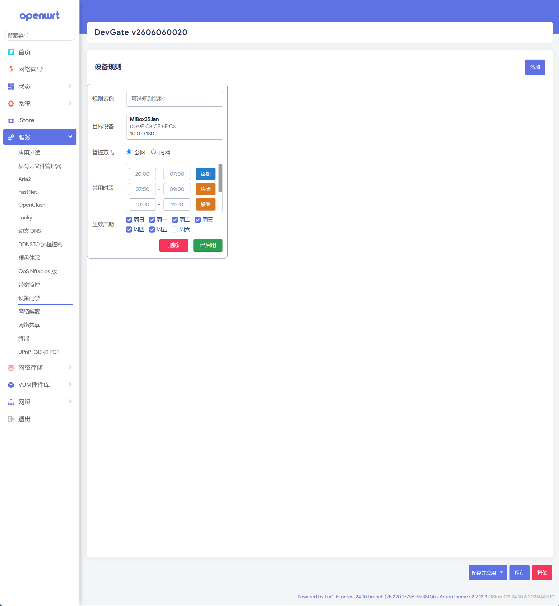

# luci-app-devgate



## 适用环境

本插件面向基于 LuCI 的 OpenWrt 系统，已在 OpenWrt 24.10 系列（并在仓库 CI 中使用 24.10.6 x86_64 SDK）进行构建测试。依赖 `firewall4`。

## 简介

`luci-app-devgate`（设备门禁）是一个基于 `firewall4` 通信规则的 LuCI 插件，用于按设备控制上网：

- 按生效日期与禁用时段对设备上网进行准入/阻止；
- 支持不同设备的“内网/公网”控制方式（通过目的区分）；
- 将生效规则同步写入 `/etc/config/firewall`（规则名以 `DevGate-` 前缀或 `devgate_` 段命名），可在 LuCI 的“防火墙 - 通信规则”中查看；
- 包含守护进程 `devgatectrl`，自动根据配置同步防火墙规则；
- 提供命令行工具 `devgate`（位于 `/usr/bin/devgate`）用于直接管理规则和诊断。

插件会自动跳过当前登录 LuCI 的设备以避免误屏蔽。

## 快速安装

1. 在 OpenWrt/路由器上上传并安装编译好的包：

```sh
opkg install /tmp/luci-app-devgate_*.ipk
rm -rf /tmp/luci-indexcache /tmp/luci-modulecache /tmp/luci-*cache
```

2. 安装后（postinst 脚本会启用并启动服务）刷新 LuCI，菜单位置：

```text
服务 -> 设备门禁
```

## 常用命令

- 启动/停止（init 脚本）:

```sh
/etc/init.d/devgate start
/etc/init.d/devgate stop
```

- 命令行管理（直接调用二进制）:

```sh
devgate start|stop|status|reload|diagnose
devgate add <id> [0|1]   # 将 uci 配置中指定 id 的设备加入托管（1=启用阻止）
devgate del <id>
```

守护进程 `devgatectrl` 会定期检查 `uci` 中的配置并同步防火墙规则，日志文件：`/var/log/devgate.log`。

## 配置说明（简要）

- 配置保存在 `/etc/config/devgate`，每个 `device` 段包含 `mac`、`comment`、`week`（生效周）、`time_ranges`（禁用时段）等；
- 插件通过设备的 `uid`（唯一识别码）映射到 firewall 的规则段名 `devgate_<uid>`；
- 当设备被禁用或配置无效时，插件会自动清理对应的 firewall 规则。

## 构建（在 OpenWrt SDK 或 buildroot）

在 OpenWrt SDK 根目录下运行：

```sh
make package/luci-app-devgate/compile V=s
```

或在 feeds/ 中按常规流程 `./scripts/feeds update -a && ./scripts/feeds install luci` 后编译对应 package。

## 调试与诊断

- 查看当前托管规则：

```sh
devgate status
```

- 运行诊断：

```sh
devgate diagnose
```

日志：`/var/log/devgate.log`。

## 贡献与许可

欢迎提交 issue/PR，许可证为 Apache-2.0（见 Makefile 中声明）。

更多实现细节请查看仓库内脚本：`root/usr/bin/devgate` 与 `root/usr/bin/devgatectrl`。
